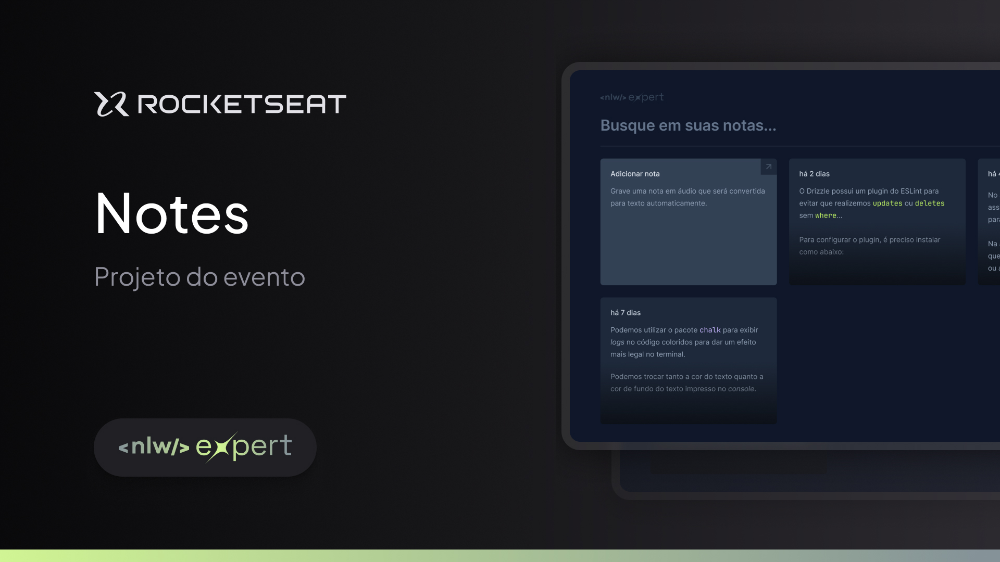

<h1 align="center"> NLW Expert - Notes </h1>

Programa exclusivo e gratuito, feito por mim para utilizar como portfólio  
<a href="https://lp.rocketseat.com.br/devlinks/inscricao?utm_source=github&utm_medium=descricao&utm_campaign=capture-devlinks&utm_term=organic&utm_content=descricao-github-mayk-brito">Estude esse projeto em formato de vídeo clicando aqui.</a>

  <a href="#-tecnologias">Tecnologias</a>&nbsp;&nbsp;&nbsp;|&nbsp;&nbsp;&nbsp;
  <a href="#-projeto">Projeto</a>&nbsp;&nbsp;&nbsp;|&nbsp;&nbsp;&nbsp;
  <a href="#-layout">Layout</a>&nbsp;&nbsp;&nbsp;|&nbsp;&nbsp;&nbsp;
  <a href="#memo-licença">Licença</a>

  

 

  

## 🚀 Tecnologias

Esse projeto foi desenvolvido com as seguintes tecnologias:

- HTML e CSS
- JavaScript
- TypeScript
- TailWind CSS
- React.Js
- Vite

## 💻 Projeto

O Notes é um site que serve para criar e salva notas, podendo usar o microfone ou a digitação normal. O site usa um API chamada speechRecognition para captura de voz, essa API possibilita que os usuários façam as notas por meio de comandos de voz. Além disso o projeto também usa o Web Storage. 

## 🔖 Layout

Você pode visualizar o layout do projeto através [DESSE LINK]https://www.figma.com/file/vhBzWM3EO94HQhGkrcyTzD/NLW-expert-•-Notes-Community?type=design&is-community-duplicate=1&fuid=. É necessário ter conta no [Figma](https://figma.com) para acessá-lo.

## :memo: Licença

Esse projeto está sob a licença MIT.

---

Feito com ♥ by Carlos Eduardo :wave: 
